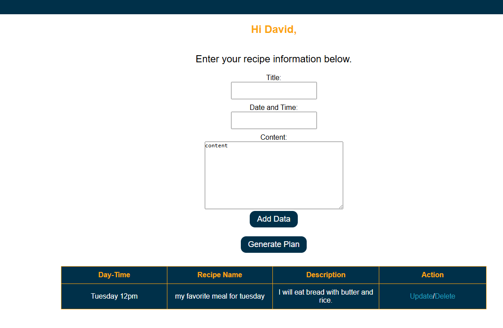
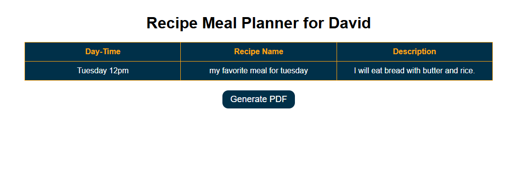
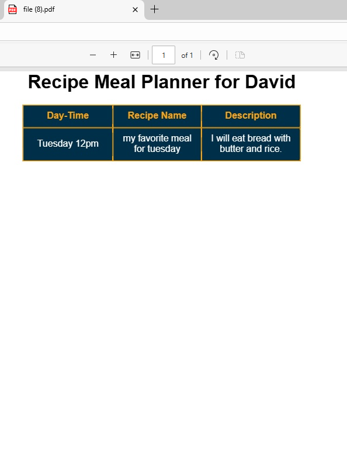

# My Django Recipe meal

# In this product I used the following technology
    #DJANGO
    #JAVASCRIPT
    #PYTHON
    #HTML
    #CSS
    #SQLALCHEMY

# What does it do?
    #This is a recipe meal app. Where users can create receipt details.

    #For someone to create a receipt, he must log in.
    
    #Users will be able to reset their password in case they forget it.

    # For user to reset their password, they must provide a valid email address.
    
    #When users click on the forget password link, they will be redirected to another page.
        where they will enter their correct login email and click the reset button.

        As soon as they finish, a click will be sent to them with the reset password link.

        They will just click on it and then it will redirect them to the reset password page.

        where they will be able to enter a new password and confirm it to get it reset.

        As soon as the user clicks the reset button, they will be redirected to the login page so they can log in.

    #When users login, if the logs in user has already created a receipe, all the receipts for this user
    will be showing on the page  with the ability to update and delete them.

    #If the user wants, they can clikc on the "genere the plan" and it will redirect them to another
    page. In the page, they will see their data and they can generate a PDF.

    #If a user does not have any recipe  he/she will not see the generate plan button

#I used Javascript to generate the pdf with html2pdf package and when the user is creating the password.
The user will be able to see how strong their password is while registering.

